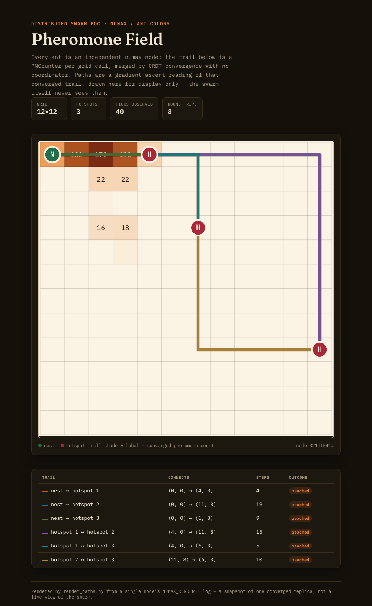
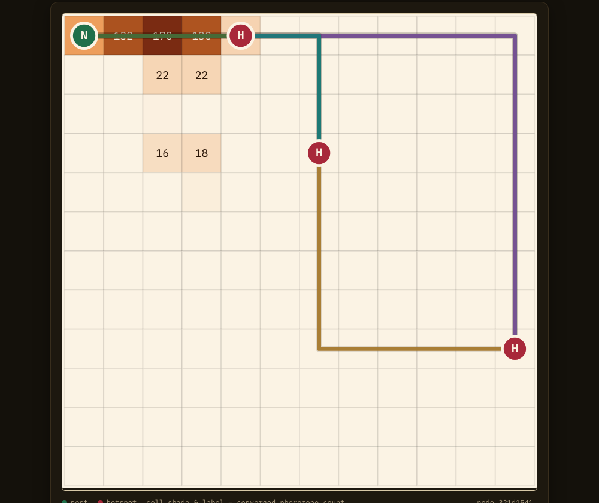

# Distributed Ant Colony Example

A distributed Ant Colony Optimization (ACO) swarm running on Numax. Each
node plays one ant foraging between a nest and one or more food sources
("hotspots") on a shared grid. The pheromone trail — the mechanism that
makes ACO work — is just a `PNCounter` per grid cell: every ant's deposit
and evaporation is an `inc`/`dec` on that CRDT, so the trail converges to
the same value on every node with no coordinator, no leader election, no
shared server.

## What It Demonstrates

- PNCounter host API used as an additive, evaporating shared field
  (`crdt_pncounter_inc` / `crdt_pncounter_dec` / `crdt_pncounter_value`),
  rather than a simple up/down counter
- GCounter used for a swarm-wide stat (`ant:trips_completed`)
- local (non-replicated) per-node state via `nx_sdk::db` persisting across
  repeated `nx run` invocations of the same node
- `nx_sdk::net::node_id`, `nx_sdk::crypto::random_bytes`,
  `nx_sdk::system::env_get` used together to build a stateful, randomized,
  configurable simulation instead of a single fixed operation
- an emergent multi-node behavior (a shared pheromone trail) rather than a
  single value converging

## Result

A 4-node run (12×12 grid, 3 hotspots, 40 ticks/ant) converges to the same
`ant:trips_completed` count on every node. A companion script
(`render_paths.py`, see below) turns one node's converged pheromone
snapshot into a heatmap plus a gradient-ascent shortest path between every
pair of nest/hotspots:



Close-up of the converged trail (darker cells = more accumulated
pheromone; the colored lines are gradient-ascent readings of the same
field, one per connection touching the nest):



## Build

From this example directory:

```bash
cd examples/distributed_ants
cargo build --release --target wasm32-unknown-unknown
```

The module will be written to:

```text
target/wasm32-unknown-unknown/release/distributed_ants.wasm
```

## How one tick works

`nx run` invokes a guest's `run()` exactly once per process, then exits —
there's no in-guest loop or sleep. So "many simulation ticks" means
re-invoking `nx run` repeatedly against the same `--datastore-path`, while
`--listen`/`--peer` keeps that node's CRDT state synced with the others.
Each invocation:

1. Reads grid size, hotspot count, seed and nest position from `NUMAX_*`
   env vars (see [Configuration](#configuration)).
2. Derives the hotspot layout deterministically from
   `(seed, grid_width, grid_height, hotspot_count)` with a seeded PRNG
   (SplitMix64) — every node computes the *identical* list without ever
   replicating it, so the whole swarm agrees on the world for free.
3. Loads this ant's position/carrying-food flag from local
   (non-replicated) `nx_sdk::db` state.
4. Picks a neighbor cell using the classic ACO edge weight — pheromone
   attraction combined with a distance-to-goal heuristic — drawn with a
   host-provided CSPRNG (`nx_sdk::crypto::random_bytes`).
5. Moves, deposits pheromone (`pncounter::inc`), and — on a fraction of
   steps — evaporates one random cell (`pncounter::dec`) to keep old
   trails decaying. No cell is ever swept globally; evaporation is as
   decentralized as the deposits.
6. On reaching any hotspot it starts carrying "food" back to the nest; on
   reaching the nest it increments the swarm-wide `GCounter`
   `ant:trips_completed`.

One correctness note worth calling out: pheromone's influence on the edge
weight is capped (`PHEROMONE_INFLUENCE_CAP` in `src/lib.rs`). Without a
cap, a cell that gets revisited early — e.g. right next to the nest —
accumulates pheromone without bound, and its weight eventually swamps the
distance heuristic no matter how far it is from any hotspot, trapping ants
in a self-reinforcing loop near the nest. Capping keeps distance always
meaningfully in the race, while still letting pheromone break ties between
similarly-distant cells. This was caught empirically: an early run
oscillated indefinitely between the nest and its immediate neighbors
before the cap was added.

## Configuration

`swarm.config.toml`:

```toml
grid_width = 12
grid_height = 12
hotspot_count = 3
seed = 1337        # must be identical across every node in the swarm
nest_x = 0
nest_y = 0
ticks_per_ant = 40
ants = 4
base_port = 9000
```

Guest WASM has no filesystem access (only `db`/`net`/`crdt`/`system`/
`crypto`/`time` host calls), so this file is parsed **host-side** by
`demo.sh` and re-exposed to every guest invocation as `NUMAX_*` env vars.
Changing `grid_width`/`grid_height`/`hotspot_count` and re-running
`demo.sh` changes the simulated world accordingly — nothing is hardcoded
in the guest.

## Run the swarm

Unlike the other examples, this one is a many-node, many-tick simulation
rather than a fixed 2-3 node scenario, so it's driven by a script instead
of individual copy-pasted commands. From the repo root:

```bash
cargo build --release -p nx-cli
cd examples/distributed_ants
cargo build --release --target wasm32-unknown-unknown
./demo.sh                      # uses swarm.config.toml
./demo.sh my-other-config.toml # or a different config file
```

This launches `ants` background nodes, fully meshed as peers, each
looping `ticks_per_ant` times over its own datastore. On exit it prints
each node's converged `ant:trips_completed` GCounter (should agree across
nodes, modulo at most 1 due to the timing of the final snapshot — that's
normal eventual-consistency skew, not a bug) and points you at the log to
render.

If you'd rather see a single raw tick by hand, the same underlying
`nx run` invocation the script loops looks like:

```bash
NUMAX_GRID_W=12 NUMAX_GRID_H=12 NUMAX_HOTSPOT_COUNT=3 NUMAX_SEED=1337 \
NUMAX_NEST_X=0 NUMAX_NEST_Y=0 \
  ../../target/release/nx run \
  target/wasm32-unknown-unknown/release/distributed_ants.wasm \
  --listen 127.0.0.1:9500 \
  --datastore-path ./data-single \
  --wait-before-run 100ms \
  --settle-for 300ms \
  --print-gcounter ant:trips_completed
```

Re-running that same command against the same `--datastore-path` advances
the same ant by one more step each time — local position/carrying state
persists in `nx_sdk::db` between invocations.

## Render the pheromone map + shortest paths

```bash
python3 render_paths.py logs/ant-0.log --grid-width 12 --grid-height 12 --out swarm.html
```

Stdlib-only (no matplotlib/numpy). It parses the structured `PHERO,x,y,v`
/ `HOTSPOT,x,y` / `NEST,x,y` lines that the last tick of node 0 emits
(gated behind `NUMAX_RENDER=1`, which `demo.sh` sets automatically), then:

- builds an in-memory copy of the converged pheromone grid,
- derives an explicit "shortest path" for **every pair** of points of
  interest — nest↔hotspot and hotspot↔hotspot — by greedy gradient ascent
  over that grid (this is a **display-only** reconstruction — the guest
  itself never computes or follows an explicit path, only local
  pheromone/distance weights). Note that ants never walk hotspot-to-hotspot
  directly; those legs are read off whatever residual trail the
  nest-hotspot traffic left behind, so they're a real but weaker signal
  than the nest-radiating paths,
- writes a single self-contained HTML report (inline SVG, no external
  assets) with the heatmap, nest/hotspot markers, and one colored line per
  connection, plus a table of every connection's step count and whether
  gradient ascent actually reached the other endpoint.

Open the resulting `swarm.html` in a browser.

## Reset

```bash
rm -rf examples/distributed_ants/data-* examples/distributed_ants/logs
```

## Notes

- Sync requires `--listen <addr>`; without it, `crdt::*` calls return
  `SyncDisabled`, matching every other example in this repo.
- `--wait-before-run` / `--settle-for` follow the same convention as the
  other examples — see `distributed_counter`'s README for a fuller
  explanation of both.
- Reusing datastores between `demo.sh` runs of the *same* config is fine;
  changing grid size or hotspot count mid-simulation isn't (positions from
  a smaller/differently-seeded world may fall outside the new grid), so
  `demo.sh` always clears `data-*`/`logs` first.

## Future direction: human-in-the-loop swarming (HILT)

*(Design notes only — nothing below is implemented in this crate.)*

Louis Rosenberg's "Artificial Swarm Intelligence" line of work
(Unanimous AI's "Swarm AI") argues that *real-time closed-loop* human
swarms — where every participant continuously nudges a shared on-screen
"puck" and watches the group's converging position, rather than casting
one-shot independent votes — consistently outperform simple
polling/averaging on forecasting and decision tasks.

The interesting overlap with this example: Numax's CRDT substrate is
*already* a closed real-time loop with no privileged writer, which is
exactly the structural property human swarming needs. A plausible
extension:

- **A human is just another peer.** A person's live input (e.g. a
  directional "nudge" from a UI they're actively dragging) becomes an
  `LWW-Register` per participant, merged into the same edge-weight
  formula ants already use — pheromone, distance heuristic, *and* human
  intent all contribute to the same weighted draw. No special-casing
  needed in the sync layer; a browser client contributing writes is
  structurally identical to another ant node.
- **Confidence weighting.** Rosenberg's work weights each participant's
  contribution by a running measure of their historical accuracy. That
  maps directly onto a `PNCounter` per participant (`inc` on outcomes that
  validate their nudges, `dec` otherwise), read back as a multiplier on
  their `LWW-Register`'s influence.
- **Graduated autonomy (the "HILT" part).** Rather than requiring a human
  in the loop for every step, route only the *consequential* writes
  through a human checkpoint — e.g. algorithmic ants keep exploring and
  laying routine pheromone autonomously, but the stronger "returning with
  food" deposit (the one that actually defines the reinforced trail)
  waits for a lightweight human confirmation, batched across many ants'
  proposals rather than gating every single step. This keeps the human
  load proportional to the decisions that matter, while cheap exploration
  stays fully autonomous.
- `--observability-listen` and `event_emit` are the natural place to
  expose the live state a human UI would need to render the "puck,"
  without needing a bespoke backend.
