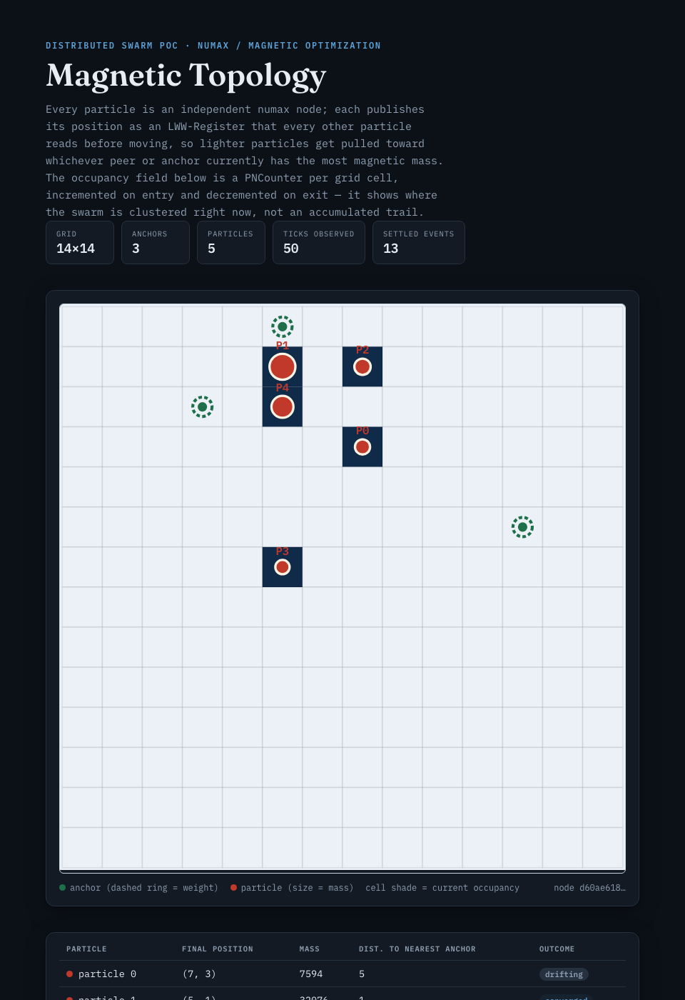
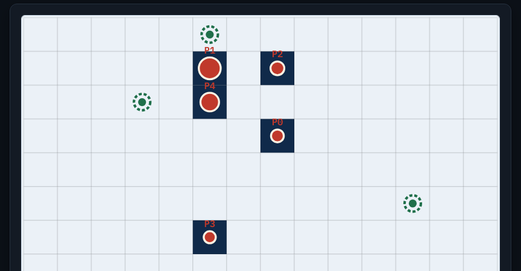

# Distributed Magnetic Optimization Algorithm Example

A distributed Magnetic Optimization Algorithm (MOA) swarm running on Numax.
MOA (Tayarani-N. & Akbarzadeh-T., 2008) models candidate solutions as
magnetic particles: each has a "mass" derived from how good its position is,
and heavier particles pull lighter ones toward them, so the swarm converges
on the strongest regions of the search space. Here the search space is a
grid and "how good" a cell is comes from its magnetic pull toward a handful
of fixed, weighted attractor points ("anchors") — the topology every
particle ends up converging around.

Unlike `distributed_ants` (where the swarm only shares an anonymous
pheromone field), every particle here *knows about the others*: it publishes
its current position as an `LWW-Register` and reads every other particle's
register before moving, so peer attraction is a real cross-node signal
rather than something reconstructed after the fact.

## What It Demonstrates

- `LWW-Register` used for live, per-participant state that every other node
  reads back (`crdt_lww_set` / `crdt_lww_get`) — a different replication
  shape than a single shared counter or field
- `PNCounter` used as a live *occupancy* field (inc on entering a cell, dec
  on leaving), rather than a monotonic, evaporating trail like
  `distributed_ants`' pheromone grid
- `GCounter` used for a swarm-wide convergence stat (`mag:settled_events`)
- local (non-replicated) per-node state via `nx_sdk::db` persisting across
  repeated `nx run` invocations of the same particle
- `nx_sdk::net::node_id`, `nx_sdk::crypto::random_bytes`,
  `nx_sdk::system::env_get` combined into a stateful, randomized,
  configurable simulation, same building blocks as `distributed_ants` but
  composed into genuine inter-agent attraction instead of trail-following
- an emergent multi-node behavior (particles clustering around whichever
  anchor is closest, pulling each other along the way) rather than a single
  value converging

## Result

A real 5-particle run (14×14 grid, 3 anchors, 50 ticks/particle,
`seed = 4242`) reports `mag:settled_events = 13` in agreement on every node,
and every particle ends up clustered around the same two nearby anchors
(the third anchor landed far enough away that no particle wandered onto
it in this run — settling is a stochastic weighted-random walk, not a
guaranteed global optimum). A companion script (`render_topology.py`, see
below) turns one node's converged occupancy snapshot into a topology
report:



Close-up of the converged topology (particle markers sized by mass, dashed
rings around anchors sized by weight):



## Build

From this example directory:

```bash
cd examples/distributed_magnets
cargo build --release --target wasm32-unknown-unknown
```

The module will be written to:

```text
target/wasm32-unknown-unknown/release/distributed_magnets.wasm
```

## How one tick works

`nx run` invokes a guest's `run()` exactly once per process, then exits —
there's no in-guest loop or sleep. So "many simulation ticks" means
re-invoking `nx run` repeatedly against the same `--datastore-path`, while
`--listen`/`--peer` keeps that node's CRDT state synced with the others.
Each invocation:

1. Reads grid size, anchor count, seed, settle radius, particle count and
   this node's own particle id from `NUMAX_*` env vars (see
   [Configuration](#configuration)).
2. Derives the anchor layout (position + weight) deterministically from
   `(seed, grid_width, grid_height, anchor_count)` with a seeded PRNG
   (SplitMix64) — every node computes the *identical* list without ever
   replicating it. The particle's own spawn cell is derived the same way,
   keyed by its particle id, so particles don't all start on top of each
   other.
3. Loads this particle's position from local (non-replicated) `nx_sdk::db`
   state, and reads every *other* particle's last published position from
   its `LWW-Register` (`mag:pos:{id}`).
4. Computes a magnetic score for each of its 4 neighbor cells: the cell's
   own pull toward the anchors, plus a capped attraction toward any peer
   that currently has more mass than this particle does right now — the
   actual MOA mechanic, lighter particles get pulled toward heavier ones.
5. Moves to one of those neighbors, drawn weighted-random with a
   host-provided CSPRNG (`nx_sdk::crypto::random_bytes`) — same pattern
   `distributed_ants` uses for its edge weights.
6. Updates the occupancy field (`pncounter::dec` the vacated cell,
   `pncounter::inc` the new one), persists its own new position locally, and
   publishes it via `lww_register::set` so every other particle sees it on
   their next tick.
7. If this puts it within `settle_radius` of its nearest anchor for the
   first time since last leaving that radius, increments the swarm-wide
   `GCounter` `mag:settled_events`.

One correctness note worth calling out, mirroring `distributed_ants`' own
pheromone-influence cap: a single peer's mass contribution to a candidate
cell's score is capped (`PEER_MASS_CAP` in `src/lib.rs`). Without a cap, a
particle that happens to spawn right on an anchor accumulates enormous mass
and its pull swamps every other particle's anchor heuristic no matter how
far away it is, collapsing the whole swarm onto one cell instead of letting
each particle settle near whichever anchor is actually closest to it.

## Configuration

`swarm.config.toml`:

```toml
grid_width = 14
grid_height = 14
anchor_count = 3
seed = 4242            # must be identical across every node in the swarm
settle_radius = 1
ticks_per_particle = 50
particles = 5
base_port = 9100
```

Guest WASM has no filesystem access (only `db`/`net`/`crdt`/`system`/
`crypto`/`time` host calls), so this file is parsed **host-side** by
`demo.sh` and re-exposed to every guest invocation as `NUMAX_*` env vars
(plus a per-node `NUMAX_PARTICLE_ID` that `demo.sh` assigns). Changing
`grid_width`/`grid_height`/`anchor_count` and re-running `demo.sh` changes
the simulated search space accordingly — nothing is hardcoded in the guest.

## Run the swarm

Like `distributed_ants`, this is a many-node, many-tick simulation, so it's
driven by a script instead of individual copy-pasted commands. From the
repo root:

```bash
cargo build --release -p nx-cli
cd examples/distributed_magnets
cargo build --release --target wasm32-unknown-unknown
./demo.sh                      # uses swarm.config.toml
./demo.sh my-other-config.toml # or a different config file
```

This launches `particles` background nodes, fully meshed as peers, each
looping `ticks_per_particle` times over its own datastore. On exit it prints
each node's converged `mag:settled_events` GCounter (should agree across
nodes, modulo at most 1 due to the timing of the final snapshot — that's
normal eventual-consistency skew, not a bug) and points you at the log to
render.

If you'd rather see a single raw tick by hand, the same underlying
`nx run` invocation the script loops looks like:

```bash
NUMAX_GRID_W=14 NUMAX_GRID_H=14 NUMAX_ANCHOR_COUNT=3 NUMAX_SEED=4242 \
NUMAX_SETTLE_RADIUS=1 NUMAX_PARTICLE_COUNT=5 NUMAX_PARTICLE_ID=0 \
  ../../target/release/nx run \
  target/wasm32-unknown-unknown/release/distributed_magnets.wasm \
  --listen 127.0.0.1:9600 \
  --datastore-path ./data-single \
  --wait-before-run 100ms \
  --settle-for 300ms \
  --print-gcounter mag:settled_events
```

Re-running that same command against the same `--datastore-path` advances
the same particle by one more step each time — local position state
persists in `nx_sdk::db` between invocations.

## Render the topology

```bash
python3 render_topology.py logs/particle-0.log --grid-width 14 --grid-height 14 --out topology.html
```

Stdlib-only (no matplotlib/numpy). It parses the structured `FIELD,x,y,v` /
`ANCHOR,x,y,weight` / `PARTICLE,id,x,y,mass` lines that the last tick of
particle 0 emits (gated behind `NUMAX_RENDER=1`, which `demo.sh` sets
automatically), then writes a single self-contained HTML report (inline
SVG, no external assets) with the occupancy heatmap, anchor and particle
markers, and a table of every particle's final position, mass, and distance
to its nearest anchor.

Open the resulting `topology.html` in a browser.

## Reset

```bash
rm -rf examples/distributed_magnets/data-* examples/distributed_magnets/logs
```

## Notes

- Sync requires `--listen <addr>`; without it, `crdt::*` calls return
  `SyncDisabled`, matching every other example in this repo.
- `--wait-before-run` / `--settle-for` follow the same convention as the
  other examples — see `distributed_counter`'s README for a fuller
  explanation of both.
- Reusing datastores between `demo.sh` runs of the *same* config is fine;
  changing grid size, anchor count, or particle count mid-simulation isn't
  (positions and particle ids from a smaller/differently-seeded world may
  fall outside the new grid or collide), so `demo.sh` always clears
  `data-*`/`logs` first.

## Future direction: adaptive anchor weights

*(Design notes only — nothing below is implemented in this crate.)*

Anchors here are fixed for the whole run, derived once from the seed. A
natural extension: let anchor weight be driven by a live external signal
instead — e.g. a `PNCounter` per anchor that something outside the swarm
(a monitoring pipeline, a human operator, another Numax module) increments
or decrements over time. Because the guest already reads anchor pull purely
through `mass_at()`, swapping "PRNG-derived fixed weight" for "current
PNCounter value" is a small, local change — the magnetic-attraction
mechanics that make particles converge around whichever anchor matters most
right now would need no modification at all. That would turn this from a
one-shot topology optimizer into a continuously re-optimizing one that
tracks a moving target.
