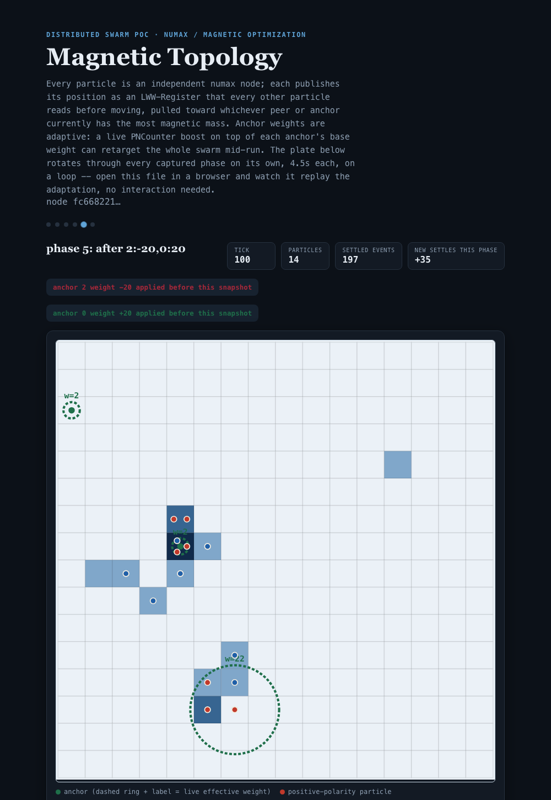

# Distributed Magnetic Optimization Algorithm Example

A distributed Magnetic Optimization Algorithm (MOA) swarm running on Numax.
MOA (Tayarani-N. & Akbarzadeh-T., 2008) models candidate solutions as
magnetic particles: each has a "mass" derived from how good its position is,
and heavier particles pull lighter ones toward them, so the swarm converges
on the strongest regions of the search space. Here the search space is a
grid and "how good" a cell is comes from its magnetic pull toward a handful
of weighted attractor points ("anchors") — the topology every particle ends
up converging around.

Unlike `distributed_ants` (where the swarm only shares an anonymous
pheromone field), every particle here *knows about the others*: it publishes
its current position as an `LWW-Register` and reads every other particle's
register before moving, so peer attraction is a real cross-node signal
rather than something reconstructed after the fact.

Two things go beyond vanilla MOA, both real forces that feed the same
movement decision, not separate modes:

- **Adaptive anchor weights.** `demo.sh` scripts a sequence of live weight
  changes (a `PNCounter` boost/cut on top of each anchor's base weight), and
  every particle re-reads every anchor's *current* weight on every tick — so
  a weight change genuinely redirects the swarm's own optimization, it isn't
  just a rendering overlay.
- **Magnetic polarity.** Every particle also has a fixed north/south-style
  polarity (alternating by particle id, so no extra state needs
  replicating). Opposite-polarity peers attract each other on top of the
  usual MOA pull; same-polarity peers repel. The swarm isn't one
  undifferentiated mass converging on the best anchor — same-polarity
  particles spread apart even while both are drawn toward the same place,
  and opposite-polarity particles tend to pair up.

## What It Demonstrates

- `LWW-Register` used for live, per-participant state that every other node
  reads back (`crdt_lww_set` / `crdt_lww_get`) — a different replication
  shape than a single shared counter or field
- `PNCounter` used two ways: as a live *occupancy* field (inc on entering a
  cell, dec on leaving), and as a live, externally-nudgeable *weight*
  adjustment per anchor — both read fresh every tick, so the guest's own
  movement logic reacts to values changed by an outside actor between ticks
- `GCounter` used for a swarm-wide convergence stat (`mag:settled_events`)
- local (non-replicated) per-node state via `nx_sdk::db` persisting across
  repeated `nx run` invocations of the same particle
- `nx_sdk::net::node_id`, `nx_sdk::crypto::random_bytes`,
  `nx_sdk::system::env_get` combined into a stateful, randomized,
  configurable simulation, same building blocks as `distributed_ants` but
  composed into genuine inter-agent attraction/repulsion instead of
  trail-following
- state that's entirely *derived*, never replicated: every particle's
  polarity is a pure function of its id, so every node computes every other
  particle's polarity locally with zero extra CRDT traffic
- an emergent multi-node behavior that *re-optimizes live*: particles
  cluster around whichever anchor currently has the most mass, visibly
  migrate to a different anchor once a scripted weight change makes it the
  new best option, and pair up by opposite polarity along the way

## Result

A real 14-particle run (16×16 grid, 3 anchors, 120 ticks/particle,
`seed = 7`, `polarity_enabled = true`) runs a 6-phase scripted scenario:
phase 1 is the plain seeded weights, then phases 2–6 each apply a live
boost/cut to one or more anchors (see [Configuration](#configuration)). The
render shows, per phase, how many *new* particles crossed into
`settle_radius` of an anchor since the previous phase — the heuristic in
numbers: phase 2 (anchor 0 boosted to weight 19) adds `+17` settles, phase 4
(anchor 2 boosted to 22) adds `+16`, phase 5 (anchor 0 re-boosted to 22)
adds `+6` — every boosted phase jumps well above the `+2`–`+6` baseline
drift of an unboosted phase.

`render_topology.py` turns one node's sequence of converged snapshots — one
per phase — into a single HTML report that **autoplays through every phase
on a loop**, no interaction needed: open it in a browser and watch the
swarm re-cluster as each scripted weight change lands.


The same report auto-rotated to phase 5, right after anchor 0 is re-boosted
to weight 22: every particle pair sharing a cell is an opposite-polarity
(red/blue) pair, not two of the same, because same-polarity particles repel
each other on top of the shared anchor pull:


### With vs. without polarity

The same scenario, same seed, run again with `polarity_enabled = false`
(the [Configuration](#configuration) toggle that restores the original,
polarity-less MOA rule — every peer with more mass attracts, nothing ever
repels) makes the effect obvious as a number, not just a visual impression:
by the end of the run, `mag:settled_events` reaches **~80** with polarity on
vs. **~197** with it off — without repulsion to spread same-polarity
particles apart, far more of the swarm piles directly onto the winning
anchor's exact cell instead of orbiting nearby, so it crosses the settle
radius far more often. The same phase 5 snapshot with polarity disabled
shows this directly: `+35` new settles that phase (vs. `+6` with polarity
on) and up to 4 particles stacked on one cell instead of tidy
opposite-polarity pairs:



## Build

From this example directory:

```bash
cd examples/distributed_magnets
cargo build --release --target wasm32-unknown-unknown
```

The module will be written to:

```text
target/wasm32-unknown-unknown/release/distributed_magnets.wasm
```

## How one tick works

`nx run` invokes a guest's `run()` exactly once per process, then exits —
there's no in-guest loop or sleep. So "many simulation ticks" means
re-invoking `nx run` repeatedly against the same `--datastore-path`, while
`--listen`/`--peer` keeps that node's CRDT state synced with the others.
Each invocation:

1. Reads grid size, anchor count, seed, settle radius, particle count and
   this node's own particle id from `NUMAX_*` env vars (see
   [Configuration](#configuration)).
2. Derives the anchor *layout* (position + base weight) deterministically
   from `(seed, grid_width, grid_height, anchor_count)` with a seeded PRNG
   (SplitMix64) — every node computes the *identical* list without ever
   replicating it. The particle's own spawn cell is derived the same way,
   keyed by its particle id, so particles don't all start on top of each
   other. Its polarity is even simpler: `particle_id % 2 == 0` is positive,
   odd is negative — no PRNG, no replication, any node can compute any
   particle's polarity from its id alone.
3. If `NUMAX_BOOST` is set (only on the scripted controller tick, see
   below), applies every `anchor_index:delta` pair in it to that anchor's
   live weight (`pncounter::inc`/`dec` on `mag:anchor_boost:{index}`).
4. Computes each anchor's *effective* weight this tick: base weight plus
   the current value of its live boost counter, floored at 1.
5. Loads this particle's position from local (non-replicated) `nx_sdk::db`
   state, and reads every *other* particle's last published position from
   its `LWW-Register` (`mag:pos:{id}`).
6. Computes a magnetic score for each of its 4 neighbor cells using the
   *effective* anchor weights: the cell's own anchor pull, plus every
   peer's capped pull *or* push depending on polarity — opposite poles
   attract (a candidate gets more attractive the closer it is to a massive
   opposite-polarity peer, the core MOA mechanic), like poles repel (the
   same candidate gets *less* attractive the closer it is to a massive
   same-polarity peer), exactly like two real magnets.
7. Moves to one of those neighbors, drawn weighted-random with a
   host-provided CSPRNG (`nx_sdk::crypto::random_bytes`) — same pattern
   `distributed_ants` uses for its edge weights.
8. Updates the occupancy field (`pncounter::dec` the vacated cell,
   `pncounter::inc` the new one), persists its own new position locally, and
   publishes it via `lww_register::set` so every other particle sees it on
   their next tick.
9. If this puts it within `settle_radius` of its nearest anchor for the
   first time since last leaving that radius, increments the swarm-wide
   `GCounter` `mag:settled_events`.

Two correctness notes worth calling out:

- **Peer influence is capped**, mirroring `distributed_ants`' own
  pheromone-influence cap: a single peer's mass contribution (attractive or
  repulsive) to a candidate cell's score is capped (`PEER_MASS_CAP` in
  `src/lib.rs`). Without a cap, a particle that happens to spawn right on an
  anchor accumulates enormous mass and its pull (or push) swamps every
  other particle's anchor heuristic no matter how far away it is.
- **Repulsion is subtracted with saturating arithmetic**, not signed math: a
  candidate's score is `base_anchor_pull + attraction - repulsion`, floored
  at 1, since candidate scores feed a weighted-random draw that needs
  strictly positive weights, not a signed net force. A cell surrounded by
  same-polarity peers never becomes "negatively attractive" — at worst it
  becomes the *least* likely of the four neighbors, not an impossible one.

A related effect worth understanding rather than "fixing": because each
anchor's pull is inverse-square in distance, a particle sitting exactly on
a heavily-boosted anchor experiences a very steep local peak — its
immediate neighbors are worth far less than the peak itself, but still far
more than the pull of a *more distant*, even-heavier anchor. That local
capture is realistic MOA/gradient-search behavior — it isn't a bug, and
it's part of why watching the phases roll by is interesting: some particles
snap onto a newly-favored anchor within a phase or two, others stay locked
onto wherever they already were.

## Configuration

`swarm.config.toml`:

```toml
grid_width = 16
grid_height = 16
anchor_count = 3
seed = 7               # must be identical across every node in the swarm
settle_radius = 1
ticks_per_particle = 120
particles = 14
base_port = 9100
polarity_enabled = true

phase_count = 6
phase2_at_tick = 21
phase2_boosts = "0:18"
phase3_at_tick = 41
phase3_boosts = "0:-17,1:20"
phase4_at_tick = 61
phase4_boosts = "1:-20,2:20"
phase5_at_tick = 81
phase5_boosts = "2:-20,0:20"
phase6_at_tick = 101
phase6_boosts = "0:-20,1:5,2:5"
```

Guest WASM has no filesystem access (only `db`/`net`/`crdt`/`system`/
`crypto`/`time` host calls), so this file is parsed **host-side** by
`demo.sh` and re-exposed to every guest invocation as `NUMAX_*` env vars
(plus a per-node `NUMAX_PARTICLE_ID` that `demo.sh` assigns). Changing
`grid_width`/`grid_height`/`anchor_count` and re-running `demo.sh` changes
the simulated search space accordingly — nothing is hardcoded in the guest.

`phase_count` counts phase 1 (the plain seeded weights), so `phase_count = 6`
means 5 scripted weight changes follow it; set it to `1` to disable the
scenario entirely and run under fixed weights, like the very first version
of this example did. For each phase `N` from 2 to `phase_count`,
`phaseN_at_tick` is when node 0 (acting as the scenario controller) applies
`phaseN_boosts` — a comma-separated list of `anchor_index:delta` pairs,
applied as deltas *on top of* the anchor's current live weight (not target
absolutes, since the underlying `PNCounter` only ever accumulates). Anchor
indices are 0-based, in the order the seeded layout derives them — run
`demo.sh` once and check the `ANCHOR` lines in `logs/particle-0.log` before
tuning these for a different seed/grid. `demo.sh` validates that indices are
in range and that tick numbers strictly increase before starting the swarm.

`polarity_enabled` toggles whether particles repel/attract by polarity at
all (see [With vs. without polarity](#with-vs-without-polarity)); set it to
`false` to fall back to the original MOA-only rule. `demo.sh` maps it to
`NUMAX_POLARITY=1`/`0` and rejects any value other than `true`/`false`.

## Run the swarm

Like `distributed_ants`, this is a many-node, many-tick simulation, so it's
driven by a script instead of individual copy-pasted commands. From the
repo root:

```bash
cargo build --release -p nx-cli
cd examples/distributed_magnets
cargo build --release --target wasm32-unknown-unknown
./demo.sh                      # uses swarm.config.toml
./demo.sh my-other-config.toml # or a different config file
```

This launches `particles` background nodes, fully meshed as peers, each
looping `ticks_per_particle` times over its own datastore. On exit it prints
each node's converged `mag:settled_events` GCounter (should agree across
nodes, modulo a small skew from the timing of the final snapshot — that's
normal eventual-consistency, not a bug) and points you at the log to render.

If you'd rather see a single raw tick by hand, the same underlying
`nx run` invocation the script loops looks like:

```bash
NUMAX_GRID_W=16 NUMAX_GRID_H=16 NUMAX_ANCHOR_COUNT=3 NUMAX_SEED=7 \
NUMAX_SETTLE_RADIUS=1 NUMAX_PARTICLE_COUNT=14 NUMAX_PARTICLE_ID=0 \
  ../../target/release/nx run \
  target/wasm32-unknown-unknown/release/distributed_magnets.wasm \
  --listen 127.0.0.1:9600 \
  --datastore-path ./data-single \
  --wait-before-run 100ms \
  --settle-for 300ms \
  --print-gcounter mag:settled_events
```

Re-running that same command against the same `--datastore-path` advances
the same particle by one more step each time — local position state
persists in `nx_sdk::db` between invocations. Add `NUMAX_BOOST=0:18` to that
command to apply a one-off boost the way the scripted scenario does.

## Render the topology

```bash
python3 render_topology.py logs/particle-0.log --grid-width 16 --grid-height 16 --settle-radius 1 --out topology.html
```

Stdlib-only (no matplotlib/numpy, no external fonts or other network
requests — the page is fully self-contained). It splits the log into one
snapshot per `SNAPSHOT,<label>` marker (one per scripted phase, gated behind
`NUMAX_RENDER=1`, which `demo.sh` sets automatically on the tick right
before each boost lands, plus a final one at the end), parses each
snapshot's `FIELD,x,y,v` / `ANCHOR,x,y,weight` / `PARTICLE,id,x,y,mass`
lines, and writes a single HTML report where every phase is stacked in the
same spot and a pure-CSS `@keyframes` animation autoplays through them in
order, on an infinite loop — no JavaScript, no click-through needed. Each
phase also reports how many *new* particles settled since the previous
phase, so the effect of that phase's weight change is a number, not just a
visual impression.

Particles sharing a cell are drawn as separate small dots arranged in a
tight ring rather than one bigger dot, so a cluster of particles reads as a
cluster, not as a single ambiguous blob; each dot is colored by that
particle's polarity (red = positive, blue = negative — computed from
`particle_id % 2`, the same rule the guest uses, so the colors always match
what actually drove the simulation).

Open the resulting `topology.html` in a browser and let it run.

## Reset

```bash
rm -rf examples/distributed_magnets/data-* examples/distributed_magnets/logs
```

## Notes

- Sync requires `--listen <addr>`; without it, `crdt::*` calls return
  `SyncDisabled`, matching every other example in this repo.
- `--wait-before-run` / `--settle-for` follow the same convention as the
  other examples — see `distributed_counter`'s README for a fuller
  explanation of both.
- Reusing datastores between `demo.sh` runs of the *same* config is fine;
  changing grid size, anchor count, or particle count mid-simulation isn't
  (positions and particle ids from a smaller/differently-seeded world may
  fall outside the new grid or collide), so `demo.sh` always clears
  `data-*`/`logs` first.
- The scripted controller boosts are only ever applied by particle 0's own
  tick loop; every other particle only ever *reads* live anchor weights,
  never writes them, so there's no risk of two nodes double-applying the
  same scripted delta.

## Future direction: driving weights from a real external signal

*(Design notes only — nothing below is implemented in this crate.)*

`demo.sh`'s phase schedule is a fixed script known in advance. A natural
extension: drive `mag:anchor_boost:{index}` from something outside the
swarm entirely — a monitoring pipeline, a human operator's live input, or
another Numax module reacting to real conditions — instead of a
pre-written tick schedule. Because the guest already reads every anchor's
effective weight fresh each tick with no other assumption about *why* it
changed, no change to the movement logic would be needed at all; only the
source of the `pncounter::inc`/`dec` calls would move from `demo.sh` to
whatever real signal should be steering the topology.
